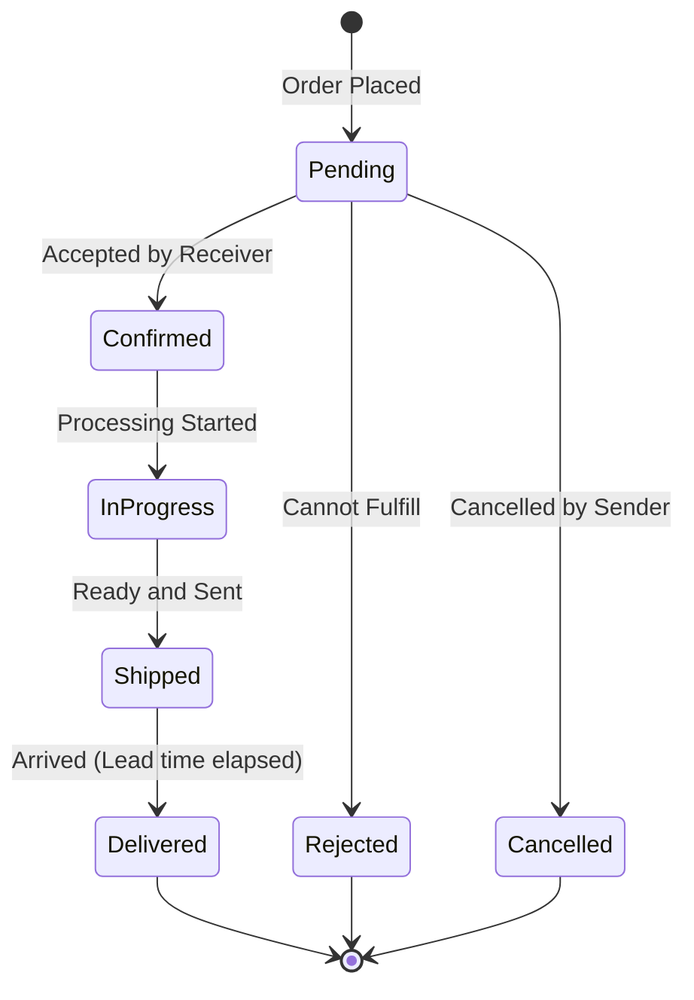

# Architecture - Week 6: Two Apps Talking

## System Diagram

```mermaid
graph LR
    subgraph Manufacturer_App [Manufacturer App (Port 8002)]
        M_CLI[CLI] --> M_Service[Service Layer]
        M_API[REST API] --> M_Service
        M_Service --> M_DB[(Manufacturer DB)]
        M_Service -- HTTP/REST --> P_API
    end

    subgraph Provider_App [Provider App (Port 8001)]
        P_CLI[CLI] --> P_Service[Service Layer]
        P_API[REST API] --> P_Service
        P_Service --> P_DB[(Provider DB)]
    end
```

## Order Lifecycle State Machine



## Data Flow: Purchase Order

1. **Manufacturer CLI**: `purchase create --supplier "ChipSupply Co" --product pcb --qty 50`
2. **Manufacturer Service**: 
   - Queries Provider Config for "ChipSupply Co" URL.
   - Sends `POST /api/orders` to Provider.
3. **Provider API**: 
   - Receives request.
   - Checks stock.
   - Calculates price and delivery day.
   - Inserts order into **Provider DB** (Status: PENDING).
   - Records event.
   - Returns order details.
4. **Manufacturer Service**: 
   - Receives response.
   - Inserts order into **Manufacturer DB** (Status: PENDING).
   - Records event.

## Data Flow: Day Advance (Polling)

1. **User**: `provider-cli day advance`
   - Provider updates its orders (Confirmed -> InProgress -> Shipped -> Delivered).
2. **User**: `manufacturer-cli day advance`
   - Manufacturer iterates over its pending external orders.
   - For each order, calls `GET /api/orders/{id}` on Provider.
   - If Provider response says `status: DELIVERED`:
     - Manufacturer updates local inventory.
     - Manufacturer updates local order status to `DELIVERED`.
     - Records event.
