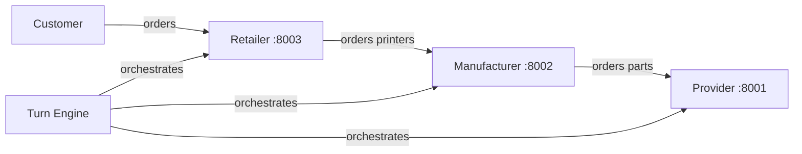

# Product Requirements Document: Week 7 - The Automated Supply Chain

## 1. Overview
The goal of this week is to complete the supply chain by introducing a **Retailer** app and automating the entire system (Provider, Manufacturer, Retailer) using a **Turn Engine**. We will also introduce the first **Gemini CLI Skill File** to allow an LLM agent to manage the Manufacturer role.

## 2. System Architecture

## 3. Core Components

### 3.1. The Retailer App
- **Purpose**: Sells finished printers to end customers.
- **Data Model**: Catalog, Customer orders, Purchase orders (to Manufacturer), Stock, Sales history, Events.
- **CLI Commands**:
    - `retailer-cli catalog` # models and retail prices
    - `retailer-cli stock` # current inventory
    - `retailer-cli customers orders` # list customer orders (optional --status)
    - `retailer-cli customers order <order_id>` # details of a customer order
    - `retailer-cli fulfill <order_id>` # ship to customer from stock
    - `retailer-cli backorder <order_id>` # mark as backordered
    - `retailer-cli purchase list` # orders placed with manufacturer
    - `retailer-cli purchase create <model> <qty>` # order printers from manufacturer
    - `retailer-cli price set <model> <price>` # set retail price
    - `retailer-cli day advance` # advance one day
    - `retailer-cli day current` # current simulation day
    - `retailer-cli export` # dump state to JSON
    - `retailer-cli import <file>` # load state from JSON
    - `retailer-cli serve --port 8003` # start the REST API
- **REST Endpoints**:
    - `GET /api/catalog`
    - `GET /api/stock`
    - `POST /api/orders` (end customer places an order)
    - `GET /api/orders` (list customer orders)
    - `GET /api/orders/{id}` (order details)
    - `POST /api/purchases` (order from manufacturer)
    - `GET /api/purchases` (list purchase orders)
    - `POST /api/day/advance`
    - `GET /api/day/current`
- **Key Behavior**:
    - Fulfill from stock if available; otherwise backorder.
    - Prices must stay above manufacturer wholesale price + margin (min 15%).
    - Auto-fulfill (or flag) backordered orders on day advance if stock has arrived.

### 3.2. The Manufacturer App (Updates)
- **New Inbound Logic**: Must accept orders from Retailers.
- **REST Endpoints**:
    - `POST /api/orders` (payload: retailer name, model, qty)
- **CLI Commands**:
    - `manufacturer-cli sales orders` # orders received from retailers
    - `manufacturer-cli sales order <id>`
    - `manufacturer-cli production release <order_id>`
    - `manufacturer-cli production status`
    - `manufacturer-cli capacity`
    - `manufacturer-cli price list`
    - `manufacturer-cli price set <model> <price>`
- **Manufacturing Logic (Day Advance)**:
    1. Released orders with BOM parts in stock -> `in_progress`, consume parts.
    2. Orders in progress for duration -> `completed`, add to finished-printer stock.
    3. Sales orders with stock -> `shipped` -> `delivered`, decrement finished stock.
    4. Poll Provider for purchase orders.

### 3.3. The Turn Engine
- **Purpose**: Orchestrates the simulation.
- **Deterministic Demand Generation**:
    - `price_factor = max(0.2, 1.0 - (price - base_price) / base_price)`
    - `adjusted_mean = mean_orders * price_factor`
    - `n = max(0, int(random.gauss(adjusted_mean, variance)))`
- **Agent Invocation**:
    - Use `gemini -p "..."` to invoke agents.
    - Timeout: 180s.
    - Capture output to `logs/day-{day:03d}-{role}.log`.

## 5. Technical Requirements & Hints
- **REST APIs**: All apps must expose REST endpoints for automation.
- **Stateless Orchestration**: The Turn Engine holds no state; it reads from and writes to the apps.
- **Logging**: All agent outputs must be captured in `logs/day-{day:03d}-{role}.log`.
- **Concurrency**: Apps must be runnable as multiple instances with different configs.
- **Timeouts**: Handle 180s timeout for agent calls to prevent simulation freeze.
- **Fresh Context**: `gemini -p` sessions are fresh contexts. Keep skill files concise and per-turn context small.
- **Skill File Iteration**: Expect 3-5 rewrites before a skill behaves reliably.
- **API Key Safety**: Never commit `.env`, `*.db`, or `logs/`.

## 6. Success Criteria & Verification
- [ ] All three apps run and communicate via REST.
- [ ] Retailer CLI works for all core commands.
- [ ] Manufacturer accepts inbound orders and processes them.
- [ ] Customer demand generator injects orders at retailers.
- [ ] Turn engine runs deterministic (stub) mode for 3 days without errors.
- [ ] One skill file exists (`skills/manufacturer-manager.md`).
- [ ] Turn engine runs with manufacturer-as-agent for at least 1 day.
- [ ] Event logs provide a coherent narrative of the simulation.

## 7. Deliverables
- **GitHub Repository** containing:
    - Three apps (`provider/`, `manufacturer/`, `retailer/`)
    - `turn_engine.py` (orchestration script)
    - `skills/manufacturer-manager.md` (the first skill)
    - `config/sim.json` (engine configuration)
    - `scenarios/smoke-test.json` (minimal scenario)
    - Updated `GEMINI.md`, `docs/prd.md`, and `README.md`.
- **Short Report** (3-4 pages) covering:
    - Architecture diagram.
    - Turn engine design and role order rationale.
    - Skill file explanation (two key decisions).
    - Proof-of-concept run excerpts and commentary.
    - Vibe-coding notes.
- **Live Demo**: Ready to run one turn with the first skill active.
