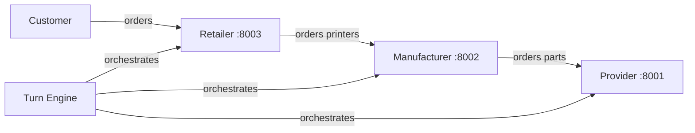

# Week 7 Report: The Automated Supply Chain

## 1. Architecture Diagram

## 2. Turn Engine Design
### Order of Operations
1. **Market Signals**: Read from scenario.
2. **Customer Demand**: Injected into Retailer.
3. **Retailer Turn**: Decisions on fulfillment and ordering.
4. **Manufacturer Turn**: Decisions on production and parts.
5. **Provider Turn**: Decisions on shipping and pricing.
6. **Advance All**: Lock-step day increment.

### Rationale for Order
We chose a **downstream-to-upstream** decision order (Retailer -> Manufacturer -> Provider). This allows upstream actors to see the demand signals generated by downstream actors in the same turn, making the system more responsive to daily changes.

## 3. The Skill File
### Decisions and Rationale
1. **Decision 1**: [Explain a decision made in manufacturer-manager.md]
2. **Decision 2**: [Explain another decision made in manufacturer-manager.md]

## 4. Proof-of-Concept Run
### Day 1 Summary
[Excerpts of agent output and commentary]

### Day 2 Summary
[Excerpts of agent output and commentary]

## 5. Vibe-Coding Notes
- **Building with Gemini CLI**: [Notes on the development experience]
- **Agent Performance**: [Notes on how the agent performed the role]
